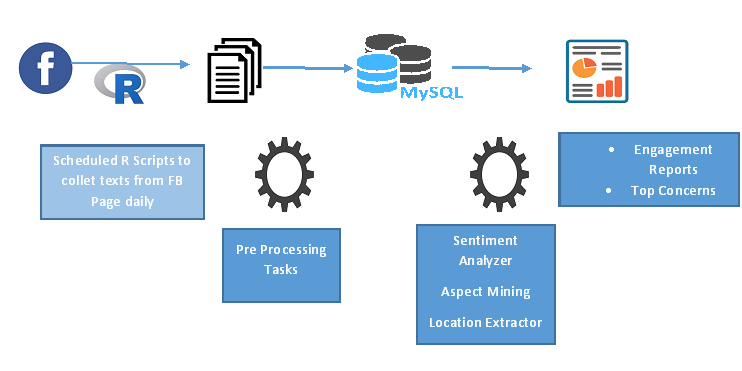
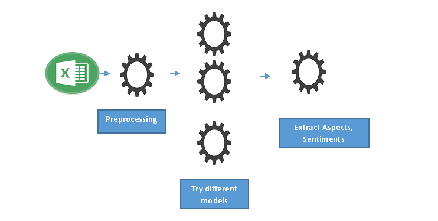

<!--
You can use HTML elements in Markdown, such as the comment element, and they won't be affected by a markdown parser. However, if you create an HTML element in your markdown file, you cannot use markdown syntax within that element's contents.
-->

  <header>
    

      

        <!-- Slide One - Set the background image for this slide in the line below -->
        

          

            <h3>Data Science - CU</h3>
            
An academia-industry amalgam

          

        

        <!-- Slide Two - Set the background image for this slide in the line below -->
        

          

            <h3>Data Science - CU</h3>
            
An academia-industry amalgam

          

        

        <!-- Slide Three - Set the background image for this slide in the line below >
        

          

            <h3>Third Slide</h3>
            
This is a description for the third slide.

          

        </div-->
      

      <a class="carousel-control-prev" href="#carouselExampleIndicators" role="button" data-slide="prev">
        
        Previous
      </a>
      <a class="carousel-control-next" href="#carouselExampleIndicators" role="button" data-slide="next">
        
        Next
      </a>
    

  </header>

  <!-- Page Content -->
  

    <h1 class="my-4">Welcome to Data Science@CU</h1>
       <!-- Features Section -->
       

        

          <h2>Goals</h2>
          <ul>
            <li>To create a platform , where people from industry , academia can share ideas , work
              together.</li>
            <li>To work on projects which can improve quality of life , especially in the domain of public
              life</li>
            <li>Formulate problem, offer internships, apply for funding</li>
            <li>Organize monthly meetups to brainstorm on particular topic and also provide update on
              project status</li>
          </ul>
        

        

          

             <button type="button" class="btn btn-primary" data-toggle="modal" data-target="#internshipModal">
              We are looking for interns !!
            </button>
          

          

            
Next Meetup !!!

            
9th June 2018

          

        

      

      <!-- /.row -->
    <!-- Portfolio Section -->
    <h2>Projects</h2>
    

      

        

          
          

            <h4 class="card-title">
              <a href="p1-social-media-influence">Social Media Influence</a>
            </h4>
            
An application, which will automate data archiving from specific FB page and generate engagement indicators, sentiments and top areas of concern. 

          

        

      

      

        

          
          

            <h4 class="card-title">
              <a href="p2-text-classification-using-hybrid-method">Text classification using hybrid method for imbalanced class</a>
            </h4>
            
There is a dataset of 10,000 tweets from important stock brokers, we want to identify the tweets which are relevant for stock market.

          

        

      

      

        

          
          

            <h4 class="card-title">
              <a href="p3-indentify-issues-text-narrative">Identify issues from text narratives</a>
            </h4>
            
A company wants to know the areas of concern from customer narratives

          

        

      

      

        

          
          

            <h4 class="card-title">
              <a href="p4-drone-based-surveillance">Drone based surveillancer</a>
            </h4>
            
Automate surveillance using a drone

          

        

      

      

        

          
          

            <h4 class="card-title">
              <a href="p5-deep-learning-computational-biology">Deep Learning for Computational Biology</a>
            </h4>
            
Integrating genomics , proteomics, epigenomics, metabolomics etc.  for finding out significant bio markers and mapping them to patient survival

          

        

      

      

        

          
          

            <h4 class="card-title">
              <a href="p6-graph-based">Graph-based approach for feature selection in high-dimensional data sets</a>
            </h4>
            
Use graph-theoretic principles for selecting a subset of features of a data set having very large number of features 

          

        

      

    

    <!-- /.row -->
    <!-- Features Section -->
    

      

        <h2>Members</h2>
        
An academia-industry amalgam:

        <ul>
          <li>University of Calcutta : Faculty, Students, Alumni, Research Scholars</li>
          <li>Other faculty from Academia</li>
          <li>IT Industry : Cognizant, IBM, TCS, Third Eye, etc</li>
          <li>Interns from other colleges</li>
        </ul>
        <a href="members">See the full list</a>
      

      

        
      

    

    <!-- /.row -->
    

    <!-- Call to Action Section >
    

      

        
Lorem ipsum dolor sit amet, consectetur adipisicing elit. Molestias, expedita, saepe, vero rerum deleniti beatae
          veniam harum neque nemo praesentium cum alias asperiores commodi.

      

      

        <a class="btn btn-lg btn-secondary btn-block" href="#">Call to Action</a>
      

    </div-->

<!-- Modal -->

  

    

      

        <h5 class="modal-title" id="exampleModalLongTitle">Internship Opportunity</h5>
        <button type="button" class="close" data-dismiss="modal" aria-label="Close">
          &times;
        </button>
      

      

        <strong>CU Data Science Group is looking for interns in the following areas : </strong>
        

          <ul>
            <li>Text Analytics (1)</li>
            <li>Computer Vision (1)</li>
            <li>Deep Learning (1)</li>
            <li>No SQL (1)</li>
          </ul>
          

            The candidate should have some  basic knowledge in 'R' and 'Python' 
            <strong>Last date of Application</strong> : 31st May 
            <strong>Stating of Internship</strong> : First/Second week of June 
            <strong>Duration</strong> : 6 weeks ( In case college reopens, last week can be waived and be done in remote mode ) 
            <i>Students will be given basic overview of machine learning , Certificates , Guidance to write research paper</i>.
          

        

      

    

  

  
