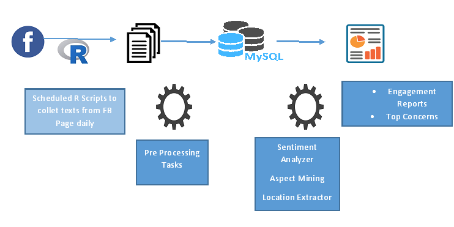

  <!-- Page Content -->
  

      <!-- Page Heading/Breadcrumbs -->
      <h1 class="mt-4 mb-3">Social Media Influence
      </h1>

     

      

        <!-- Post Content Column -->
        

          <!-- Preview Image -->
          

          

          <!-- Date/Time -->
          
Posted on January 1, 2017 at 12:00 PM

          

          <!-- Post Content -->
          

            <strong>Objective</strong>
            
Develop an application, which will automate data archiving from specific FB page and generate engagement indicators, sentiments and top areas of concern. 

            <strong>Approach</strong> 
            
Use open source API to get the data, store the data in a MYSQL database in a cloud environment, generate excel based reports. 

            <strong>Current Status</strong> 
            
This has been used on local traffic police site, the codes for ML components are done, hosting, scheduling and putting it in database is in progress.  

            <strong> Next Step</strong>
            
Once complete, engage with Police, to refine this better and also to generalize for other civic and public entities.

            <strong>Team Members</strong>
            <ul>
              <li>Saptarsi Goswami (Faculty)</li>
              <li>Ms. Rashika Daga (Intern)</li>
              <li>Mr. Allama Hossain (Intern)</li>
              <li>Mr. Rajib Dey (Data scientist -  Third Eye)</li>	
            </ul>
           
          

       

     
        

     

      

      <!-- /.row -->

    

  <!-- /.container -->

