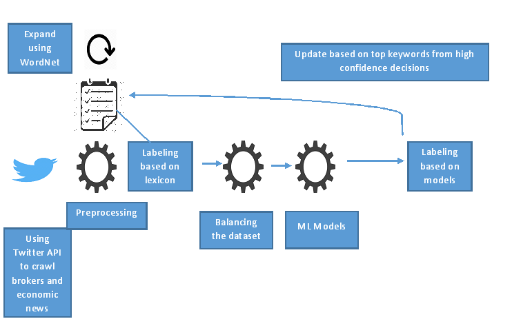

  <!-- Page Content -->
  

      <!-- Page Heading/Breadcrumbs -->
      <h1 class="mt-4 mb-3">Text classification using hybrid method for imbalanced class
      </h1>

     

      

        <!-- Post Content Column -->
        

          <!-- Preview Image -->
          

          

          <!-- Date/Time -->
          
Posted on January 1, 2017 at 12:00 PM

          

          <!-- Post Content -->
          

            <strong>Objective</strong>
            
There is a dataset of 10,000 tweets from important stock brokers, we want to identify the tweets which are relevant for stock market. 

            <strong>Approach</strong> 
            
A mixed approach combining lexical based method with machine learning based methods. SMOTE is used for class imbalance problem, WordNet is used to grow the lexicons. 

            <strong>Result</strong>
            
F score has increased from 0.69 to 0.98

            <strong>Current Status</strong> 
            
We are on the process of submitting this in Journal.  

            <strong> Next Step</strong>
            
Identify Industry specific and stock specific actionable insights from the relevant stocks.

            <strong>Team Members</strong>
            <ul>
              <li>Saptarsi Goswami (Faculty)</li>
              <li>Mr. Asish Chowdhury (IT Professional with 15 years of experience)</li>
              <li>Mr. Sourav Malakar (Alumnus)</li>
            </ul>
           
          

       

     
        

     

      

      <!-- /.row -->

  

  <!-- /.container -->
