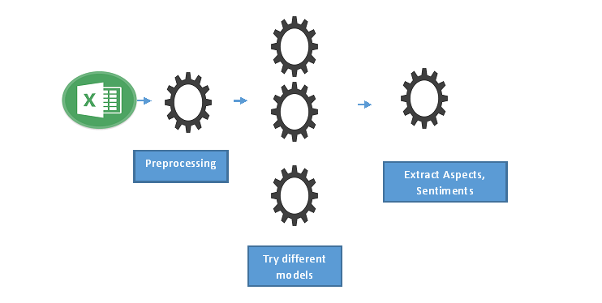

  <!-- Page Content -->
  

      <!-- Page Heading/Breadcrumbs -->
      <h1 class="mt-4 mb-3">Identify issues from text narratives
      </h1>

     

      

        <!-- Post Content Column -->
        

          <!-- Preview Image -->
          

          

          <!-- Date/Time -->
          
Posted on January 1, 2017 at 12:00 PM

          

          <!-- Post Content -->
          

            <strong>Objective</strong>
            
A company wants to know the areas of concern from customer narratives.

            <strong>Approach</strong> 
            
A step wise approach starting with term frequency, topic model and neural modeling will be built, in consultation with the company.

            <strong>Team Members</strong>
            <ul>
              <li>Saptarsi Goswami (Faculty)</li>
              <li>Mr. Susanta Dutta ( M.Tech Student)</li>
            </ul>
           
          

       

     
        

     

      

      <!-- /.row -->

  

  <!-- /.container -->

