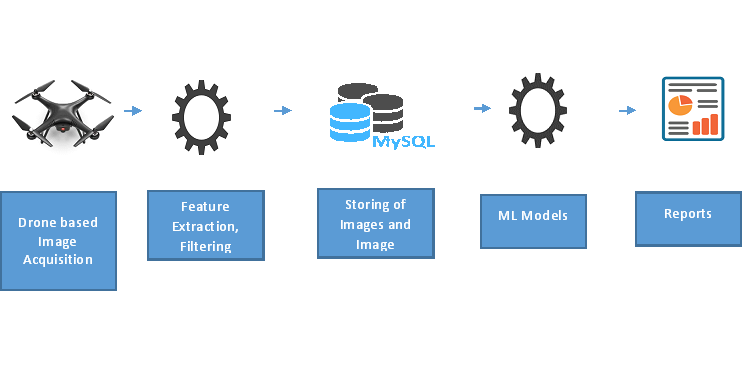

  <!-- Page Content -->
  

      <!-- Page Heading/Breadcrumbs -->
      <h1 class="mt-4 mb-3">Drone based surveillance
      </h1>

     

      

        <!-- Post Content Column -->
        

          <!-- Preview Image -->
          

          

          <!-- Date/Time -->
          
Posted on January 1, 2017 at 12:00 PM

          

          <!-- Post Content -->
          

            <strong>Objective</strong>
            
University of Calcutta has a huge campus.  Use a drone to do a autonomous surveillance.

            <strong>Approach</strong> 
            
Build a drone for autonomous flight at a scheduled time.  Capture images with annotated GPS, store it in a NO SQL database and apply computer vision techniques to identify actionable. 

            <strong>Current Status</strong> 
            
Drone has been integrated with GPS module and camera, balancing is going on.  

            <strong> Next Step</strong>
            
Complete the balancing.

            <strong>Team Members</strong>
            <ul>
              <li>Saptarsi Goswami (Faculty)</li>
              <li>Dr. Himadri Nath Saha (Visiting Faculty)</li>
              <li> Hillol , Indranil ( Students)</li>
            </ul>
           
          

       

     
        

     

      

      <!-- /.row -->

  

  <!-- /.container -->
