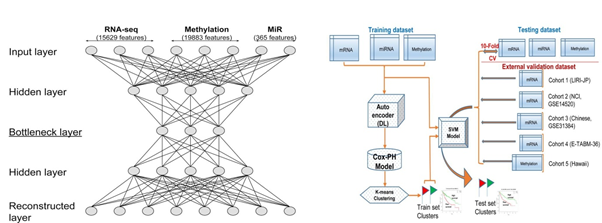

  <!-- Page Content -->
  

      <!-- Page Heading/Breadcrumbs -->
      <h1 class="mt-4 mb-3">Deep Learning for Computational Biology
      </h1>

     

      

        <!-- Post Content Column -->
        

          <!-- Preview Image -->
          

          

          <!-- Date/Time -->
          
Posted on January 1, 2017 at 12:00 PM

          

          <!-- Post Content -->
          

            <strong>Objective</strong>
            
Integrating genomics , proteomics, epigenomics, metabolomics etc.  for finding out significant bio markers and mapping them to patient survival. 

            <strong>Approach</strong> 
            
To identify significant features from the multiomics data and develop deep neural network based models for their integration. 

            <strong>Current Status</strong> 
            
The model has been successfully built, testing and evaluation is going on.  

            <strong> Next Step</strong>
            
Publish results.

            <strong>Team Members</strong>
            <ul>
              <li>Mr. Dibyendu Bikash Seal (Faculty)</li>
              <li>Dr. Vivek Das (Bioinformatician)</li>
            </ul>
           
          

       

     
        

     

      

      <!-- /.row -->

  

  <!-- /.container -->
